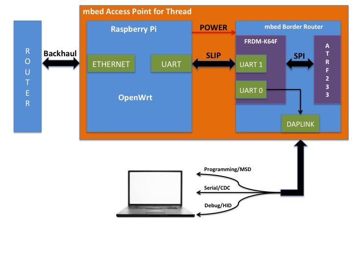
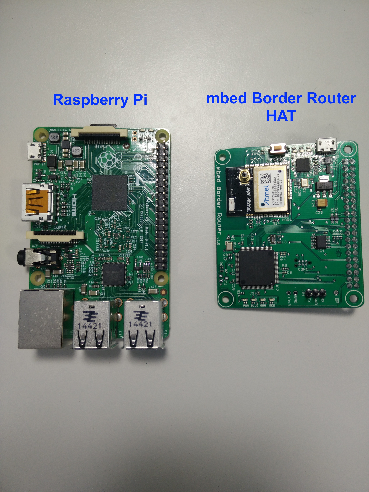
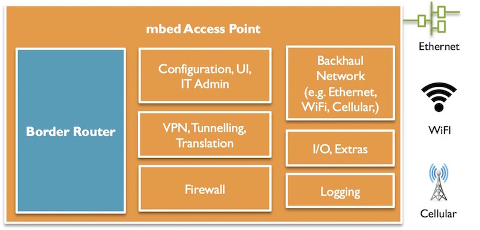

<!--- Copyright (c) 2016 ARM Limited. All rights reserved.) --->

# mbed Access Point for Low Power Wireless Networks

This document provides instructions for building an mbed Access Point for low power wireless networks (Thread or 6LoWPAN) based on Raspberry Pi 2B and the mbed 6LoWPAN Border Router. The mbed access point provides the necessary features to integrate and manage low power wireless networks into an IT environment and cope with existing backhaul networks.

You can:

* [Use a prebuilt image based on OpenWrt for Raspberry Pi 2B](#using-the-prebuilt-image).
* [Generate an image from a source](#generating-an-image-from-source).

## The architecture

The mbed access point consists of two embedded boards, an mbed Border Router and a Linux Router:

The Border (or Edge) Router is an IPv6 router that routes between regular and Thread/6LoWPAN network segments. The Thread/6LoWPAN is designed for highly constrained IP networking, where bandwidth or energy is in short supply. Consequently, the Border Router has some additional functionality to translate between the two domains.

The Linux Router is a resource-rich device capable of running Linux or a Linux-like operating system. It provides features, such as VLAN support, authentication and authorization services, network management and logging, tunneling support, firewall and wireless mesh network management, that IT administrators typically expect.

This design makes the access point mesh-agnostic, so it can work with both a [Thread](https://www.threadgroup.org/) and a 6LoWPAN Border Router with no (or minimal) changes to the Linux Router.

## Hardware components

The figure below provides an overview of the access point's hardware components:

<span class="images"></span>

You need:

1. Raspberry Pi 2B (Linux Router).
1. [mbed 6LoWPAN Border Router HAT](https://developer.mbed.org/platforms/mbed-6LoWPAN-Border-Router-HAT/).
1. Micro-USB cable.
1. Micro-SD card.
1. Micro-SD to SD card adapter.
1. Ethernet cable.

<span class="images"></span>

## Software components

The picture below outlines the software components of the mbed access point.



Once you have all the hardware components needed, you can start building the mbed access point. Remember that you have two options: using a prebuilt image, or generating a new image from source.

### Installing the mbed access point image on the Raspberry Pi

#### Using the prebuilt image

The prebuilt image for Raspberry Pi 2B contains the necessary modules and packages to convert a Raspberry Pi into an OpenWrt-based Linux Router.

The current version of mbed Access Point requires IPv6 support in the backbone network to set up end-to-end communication (Thread/6LoWPAN end nodes talking to [mbed Device Connector](https://connector.mbed.com/)) because tunneling support is not yet available. However, the image includes a default [ULA](https://tools.ietf.org/html/rfc4193) prefix `fd00:db80::/64`, which enables the device to set up a Thread/6LoWPAN network without IPv6 support. In this configuration, Thread/6LoWPAN end nodes can only communicate with mbed Access Point.

To use the prebuilt image:

1. Download the mbed Access Point [image!](binaries/openwrt-mbedap-v2.0.0-brcm2708-bcm2709-rpi-2-ext4-sdcard.img).
1. Install the image on a Micro-SD card. The [link](https://www.raspberrypi.org/documentation/installation/installing-images/) provides step-by-step instructions.
1. Insert the Micro-SD card into the Raspberry Pi's Micro-SD card slot.

If you are happy with the image provided in the repository, which contains the default configuration, then you can skip the next section and go to [prepare the mbed border router](#prepare-the-mbed-border-router).

#### Generating an image from source

This repository contains the build system for the mbed Access Point, which is based on the OpenWrt. This allows you to build the image from source:

1. Install the build system [prerequisites](https://wiki.openwrt.org/doc/howto/buildroot.exigence).
1. Clone the repository onto a local machine.
1. Run `./scripts/feeds update -a` to get all the latest package definitions defined in `feeds.conf.default`.
1. Run `./scripts/feeds install -a` to install symlinks of them into `package/feeds/`.
1. Run `make menuconfig` to change the configuration for your image.
1. Run Make to build the mbed Access Point image.

    ```
    make
    ```
Use V=s for verbose build log:

    ```
    make V=s
    ```
1. The generated image (``.img` file) is in the directory ``./bin/brcm2708/``.
1. Install the image on a Micro-SD card. The [link](https://www.raspberrypi.org/documentation/installation/installing-images/mac.md) provides step-by-step instructions.
1. Insert the Micro-SD card into the Raspberry Pi's Micro-SD card slot.

## Prepare the mbed Border Router

### Installing the binary

___Generating the binary___

The instructions to generate the binary for the mbed Border Router are available [here](https://github.com/ARMmbed/nanostack-border-router).

**Note:** Use the preconfigured `.json` file `configs/Thread_SLIP_Atmel_RF.json` as `mbed_app.json` to use SLIP protocol for backhaul network.

___Installing___

1. Connect the mbed 6LoWPAN Border Router to a desktop or laptop using a Micro-USB cable.
1. Ensure that the blue jumper (RESET-EN) is in the **off** position.
1. Program your binary on the mbed 6LoWPAN Border Router using drag and drop. Wait until the red LED stops blinking to ensure that programming is complete.
1. Attach the mbed 6LoWPAN Border Router to the Raspberry Pi, so it fits firmly on top of the GPIO headers.
1. Don't forget to move the blue jumper (RESET-EN) to the **on** position.

**Note**: mbed 6LoWPAN Border Router will be held in reset either until LAN interface on RPi is up and has a global IPv6 addresses, or for a maximum of 20 seconds.

## Communicating with the mbed Access Point using SSH or web GUI

The mbed Access Point supports both the command-line (SSH) and graphical user interface (web). For testing purpose, we'll use command line (SSH) to enter and execute the commands.

**Tip:** You can also use the web GUI to configure and check the health of the mbed access point.

___Identifying the IP address___

You can use either of the following methods to identify the IP address of the mbed access point:

Method 1:

1. Power on the Raspberry Pi.
1. Wait until the red LED on the Raspberry Pi stops blinking.
1. Power off the Raspberry Pi.
1. Remove the Micro-SD card.
1. Insert the Micro-SD card into the laptop using a *Micro-SD to SD card* adapter. The SD card mounts automatically.
1. The IP address of the mbed access point is in the file `ip_address.txt`.

Method 2:

1. Connect the Raspberry Pi to the network over Ethernet.
1. Power on the Raspberry Pi.
1. Monitor LLDP traffic on your network using Wireshark. The mbed access point sends LLDP advertisements, which contain the IP address.

___Using SSH___

You can use secure shell (`ssh`) to remotely access the mbed access point on the IP address you identified in the previous step:

    ```
    ssh root@<mbed ap ip address>
    ```

**Note:** SSH access is enabled on the WAN interface. We recommend you set a strong password for the root account, or [use the SSH Public Key authentication](https://wiki.openwrt.org/oldwiki/dropbearpublickeyauthenticationhowto).

___Using the web___

mbed Access Point runs a LuCI instance, which you can access using the URL `https://<mbed ap ip address>`.

Use root user credentials to log in.

## Testing and verifying network connectivity

Once you have followed all the instructions, you have an mbed access point capable of managing low power wireless networks. Create an example Thread network to perform basic tests to verify the network connectivity between the Linux Router and the mbed Border Router.

### Backbone network with IPv4 support only

As described before, if your backbone network only supports IPv4, then the ULA address is used to set up the Thread network. In this case, the scope of the traffic is limited to the mbed access point, as the ULA addresses are not routable over the Internet. However, all  devices in the Thread network (mbed Access Point, the mbed Border Router and end nodes) can talk to each other.

Ping the Border Router from the Linux Router:

1. Power up the Raspberry Pi, and wait until both the Raspberry Pi and the Border Router are up.
1. Log into Raspberry Pi (Linux Router) using SSH:

    ```
    ssh root@<mbed access point ip address>
    ```

1. Run the `ifconfig` command, and ensure that link-local and unique local address are set up on the LAN (sl0) interface:

    ```
    sl0       Link encap:UNSPEC  HWaddr 00-00-00-00-00-00-00-00-00-00-00-00-00-00-00-00  
          inet addr:10.99.99.1  P-t-P:10.99.99.1  Mask:255.255.255.0
          inet6 addr: fe80::669f:f10:87d:3050/64 Scope:Link
          inet6 addr: fd00:db80::1/64 Scope:Global
          UP POINTOPOINT RUNNING NOARP MULTICAST  MTU:1500  Metric:1
          RX packets:7 errors:0 dropped:0 overruns:0 frame:0
          TX packets:13 errors:0 dropped:0 overruns:0 carrier:0
          collisions:0 txqueuelen:10
          RX bytes:464 (464.0 B)  TX bytes:1680 (1.6 KiB)
    ```

1. Run `ip -6 route show`, and ensure that the routing table has an entry to route packets through the LAN (sl0) interface:

    ```
    fd00:db80::/64 dev sl0  proto static  metric 1024  pref medium
    fe80::/64 dev sl0  proto kernel  metric 256  pref medium
    ```

1. Connect the mbed Border Router to your laptop using a Micro-USB cable.
1. To monitor logs form the Border Router, you can use terminal utilities such as Minicom or PuTTY. Make sure the terminal utility is set to 115200 baud rate and 8N1.
1. The Border Router uses the router advertisements that the Linux Router sends to generate IPv6 addresses for both the backhaul and radio interfaces.
1. Wait until the bootstrap is complete.

```
[INFO][app ]: Starting NanoStack Border Router...
[INFO][app ]: Build date: Jun 15 2017 13:48:37
[INFO][brro]: NET_IPV6_BOOTSTRAP_AUTONOMOUS
[INFO][app ]: Using SLIP backhaul driver...
[DBG ][slip]: SLIP driver id: 1
[DBG ][brro]: Backhaul driver ID: 1
[DBG ][brro]: Create Mesh Interface
[INFO][brro]: thread_if_id: 1
[INFO][brro]: thread_interface_up
[INFO][brro]: PAN ID 700
[INFO][brro]: RF channel 16
[DBG ][ThSA]: service init interface 1, port 61631, options 0
[DBG ][ThSA]: service tasklet init
[DBG ][coap]: Coap random msg ID: 31602
[DBG ][coap]: Coap BLOCKWISE_MAX_TIME_DATA_STORED: 60
[DBG ][ThSA]: Service 1, Uri registration uri: a/nd
[DBG ][ThSA]: Service 1, Uri registration uri: n/mr
[DBG ][ThSA]: service init interface 1, port 49191, options 130
[DBG ][ThSA]: Service 2, Uri registration uri: c/mg
[DBG ][ThSA]: Service 2, Uri registration uri: c/ag
[DBG ][ThSA]: Service 2, Uri registration uri: c/pg
[DBG ][ThSA]: Service 2, Uri registration uri: c/tx
[DBG ][ThSA]: Service 2, Uri registration uri: c/cs
[DBG ][ThSA]: Service 2, Uri registration uri: c/cg
[DBG ][ThSA]: Service 2, Uri registration uri: c/cp
[DBG ][ThSA]: Service 2, Uri registration uri: c/ca
[DBG ][ThSA]: service init interface 1, port 61631, options 0
[DBG ][ThSA]: Service 3, Uri registration uri: c/mg
[DBG ][ThSA]: Service 3, Uri registration uri: c/ag
[DBG ][ThSA]: Service 3, Uri registration uri: c/pg
[DBG ][ThSA]: Service 3, Uri registration uri: c/cg
[DBG ][ThSA]: Service 3, Uri registration uri: c/pq
[DBG ][ThSA]: Service 3, Uri registration uri: c/es
[DBG ][ThSA]: Service 3, Uri registration uri: c/ab
[DBG ][ThSA]: service init interface 1, port 61631, options 0
[DBG ][ThSA]: Service 4, Uri registration uri: d/dg
[DBG ][ThSA]: Service 4, Uri registration uri: d/dr
[DBG ][ThSA]: Service 4, Uri registration uri: d/dq
[DBG ][ThSA]: service init interface 1, port 61631, options 0
[INFO][brro]: mesh0 bootstrap ongoing...
[DBG ][brro]: backhaul_interface_up: 1
[DBG ][brro]: Backhaul interface ID: 2
[DBG ][brro]: Backhaul bootstrap started
[DBG ][ThSA]: service tasklet initialised
[DBG ][rnvm]: platform_nvm_read() com.arm.nanostack.thread.static_link_cfg len=120
[DBG ][rnvm]: platform_nvm_key_create() com.arm.nanostack.thread.static_link_cfg len=120
[DBG ][rnvm]: platform_nvm_write() com.arm.nanostack.thread.static_link_cfg len=120
[DBG ][rnvm]: platform_nvm_flush()
[DBG ][rnvm]: platform_nvm_read() com.arm.nanostack.thread.static_link_cfg len=120
[DBG ][slip]: slip_if_tx(): datalen = 72
[DBG ][slip]: slip_if_tx(): datalen = 64
[DBG ][slip]: slip_if_tx(): datalen = 56
[DBG ][slip]: slip_if_tx(): datalen = 72
[DBG ][slip]: slip_if_tx(): datalen = 64
[INFO][brro]: BR interface_id: 2
[INFO][TBRH]: Ethernet (eth0) bootstrap ready. IP: fd00:db80::995:d4e9:c379:7fe3
[INFO][brro]: Backhaul interface addresses:
[INFO][brro]:  [0] fe80::dc42:77ff:fe15:1abd
[INFO][brro]:  [1] fd00:db80::995:d4e9:c379:7fe3
[DBG ][TBRH]: Eth0 connection status: 1
[DBG ][TBRH]: mesh0 is down
[DBG ][slip]: slip_if_tx(): datalen = 72
[DBG ][ThSA]: Service 3, Uri registration uri: a/as
[DBG ][ThSA]: Service 3, Uri registration uri: a/ar
[DBG ][ThSA]: Service 3, Uri registration uri: c/lp
[DBG ][ThSA]: Service 3, Uri registration uri: c/la
[DBG ][ThSA]: Service 3, Uri registration uri: a/sd
[DBG ][ThSA]: Service 3, Uri registration uri: c/as
[DBG ][ThSA]: Service 3, Uri registration uri: c/ps
[DBG ][ThSA]: Service 3, Uri registration uri: c/cs
[DBG ][ThSA]: service init interface 1, port 61631, options 0
[DBG ][ThSA]: Service 6, Uri registration uri: a/aq
[DBG ][ThSA]: service init interface 1, port 61631, options 0
[DBG ][ThSA]: Service 7, Uri registration uri: a/an
[DBG ][ThSA]: Service 7, Uri registration uri: a/ae
[INFO][brro]: Thread bootstrap ready
[INFO][brro]: RF interface addresses:
[INFO][brro]:  [0] fe80::d0c9:a7ad:6815:cf0f
[INFO][brro]:  [1] fd00:db8::2c9d:98ae:278f:d63f
[INFO][brro]:  [2] fd00:db8::ff:fe00:9c00
[INFO][brro]:  [3] fd00:db8::ff:fe00:fc00
[DBG ][TBRH]: mesh0 connection status: 1
[DBG ][TBRH]: DHCP server started
[DBG ][CoSA]: Service 5, send CoAP request payload_len 20
[DBG ][coap]: sn_coap_builder_calc_needed_packet_data_size_2
[DBG ][coap]: sn_coap_protocol_build - payload len 20
[DBG ][coap]: sn_coap_builder_2
[DBG ][coap]: sn_coap_builder_calc_needed_packet_data_size_2
[DBG ][coap]: sn_coap_builder_2 - message len: [36]
[DBG ][coap]: sn_coap_protocol_build - msg id: [31602], bytes: [36]
[DBG ][ThSA]: Service 5, CoAP TX Function - mid: 31602
[DBG ][TBRH]: Updated fd00:db80::/64 prefix
[DBG ][ThSA]: service recv socket data len 36
[DBG ][coap]: sn_coap_protocol_parse
[DBG ][CoSA]: CoAP status:0, type:0, code:2, id:31602
[DBG ][ThSA]: Service 3, call request recv cb uri a/sd
[DBG ][ThSA]: Service 3, Uri unregistration uri: c/tx
[DBG ][CoSA]: Service 3, send CoAP response
[DBG ][coap]: sn_coap_builder_calc_needed_packet_data_size_2
[DBG ][coap]: sn_coap_protocol_build - payload len 0
[DBG ][coap]: sn_coap_builder_2
[DBG ][coap]: sn_coap_builder_calc_needed_packet_data_size_2
[DBG ][coap]: sn_coap_builder_2 - message len: [10]
[DBG ][coap]: sn_coap_protocol_build - msg id: [31602], bytes: [10]
[DBG ][ThSA]: Service 3, CoAP TX Function - mid: 31602
[DBG ][ThCH]: send from source address fd:00:0d:b8:00:00:00:00:00:00:00:ff:fe:00:9c:00
[DBG ][slip]: slip_if_tx(): datalen = 72
[DBG ][slip]: slip_if_tx(): datalen = 106
[DBG ][ThSA]: service recv socket data len 10
[DBG ][coap]: sn_coap_protocol_parse
[DBG ][CoSA]: CoAP status:0, type:32, code:68, id:31602
[DBG ][CoSA]: Service 5, response received
[DBG ][slip]: slip_if_tx(): datalen = 72
[DBG ][slip]: slip_if_tx(): datalen = 162
[DBG ][slip]: slip_if_tx(): datalen = 162
[DBG ][slip]: slip_if_tx(): datalen = 162
[DBG ][slip]: slip_if_tx(): datalen = 72
[DBG ][slip]: slip_if_tx(): datalen = 228
[DBG ][slip]: slip_if_tx(): datalen = 228
[INFO][app ]: Heap size: 50000, Reserved: 16948, Reserved max: 18832, Alloc fail: 0
[INFO][brro]: Backhaul interface addresses:
[INFO][brro]:  [0] fe80::dc42:77ff:fe15:1abd
[INFO][brro]:  [1] fd00:db80::995:d4e9:c379:7fe3
[INFO][brro]: RF interface addresses:
[INFO][brro]:  [0] fe80::d0c9:a7ad:6815:cf0f
[INFO][brro]:  [1] fd00:db8::2c9d:98ae:278f:d63f
[INFO][brro]:  [2] fd00:db8::ff:fe00:9c00
[INFO][brro]:  [3] fd00:db8::ff:fe00:fc00
[INFO][brro]:  [4] fd00:db8::ff:fe00:fc01
[INFO][brro]:  [5] fd00:db80::d0c9:a7ad:6815:cf0f
```

1. The line `[INFO][brro]:  [1] fd00:db80::995:d4e9:c379:7fe3` indicates the IPv6 address of the backhaul interface.
1. The line `[INFO][brro]:  [5] fd00:db80::d0c9:a7ad:6815:cf0f` indicates the IPv6 address of radio interface.
1. Switch to a terminal with the SSH connection to the Linux Router.
1. Try pinging the mbed Border Router using the ULA address:

```
ping6 fd00:db80::995:d4e9:c379:7fe3    // Pinging backhaul interface
ping6 fd00:db80::d0c9:a7ad:6815:cf0f     // Pinging radio interface
```

### Backbone network with IPv6 and DHCP-PD support

The mbed access point includes `odhcp6c` module, which is a minimal DHCPv6 and RA-client. `odhcp6c` supports RA + stateful DHCPv6 (IA_NA or IA_PD or both). If the backbone supports IPv6 and DHCP-PD, then `odhcp6c` requests a global prefix from the backbone router and configures the Thread network according to the prefix received.

### Creating a Thread network

Congratulations! You have just created an mbed access point for Thread network. Follow the instructions described in [`mbed-os-example-client`](https://github.com/ARMmbed/mbed-os-example-client) to set up Thread end nodes.

**Tip:** Please ignore the instructions regarding the border router because it is part of the mbed access point.

The end nodes send LWM2M registration messages to mbed Device Connector.

**Note:** If your backbone network doesn't support IPv6, then the mbed access point does not send these messages; you can still ping all the end nodes from the mbed access point.

If you have any questions or would like to start a discussion, then please create an issue in the [mbed access point GitHub repository](https://github.com/ARMmbed/mbed-access-point).

The [Horizon 2020 programme](http://ec.europa.eu/programmes/horizon2020/) of the European Union, under grant agreement number 644332, partially supports this work.
