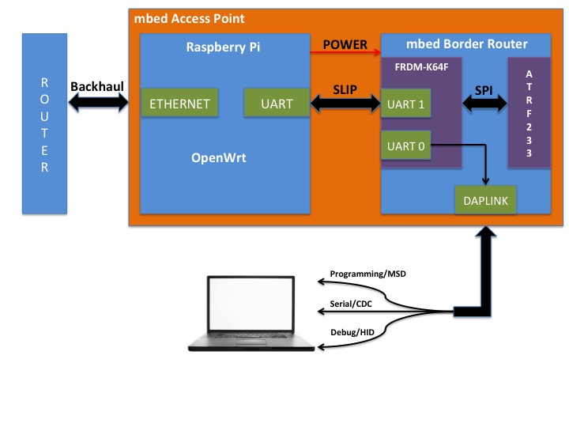

[//]: # (           Copyright (c) 2016 ARM Limited. All rights reserved.)

# mbed Access Point

mbed Access Point is a wireless access point that manages 6LoWPAN networks. It is a combination of mbed 6LoWPAN Border Router and the Linux Router. It provides the necessary features to integrate a 6LoWPAN network into an IT environment and to cope with existing backhaul networks.   

This document provides instructions on how to build an mbed Access Point based on Raspberry Pi 2B and the [mbed 6LoWPAN Border Router](https://github.com/ARMmbed/k64f-border-router).

You can:

* [Use a pre-built image based on OpenWrt for Raspberry Pi 2B](#using-the-pre-built-image).
* [Generate an image from a source with custom configuration](#generating-an-image-from-source).

## The architecture

The architecture described in this document consists of two embedded boards, an mbed 6LoWPAN Border Router and a Linux Router. The motivation behind this two-board design is to achieve a mesh-agnostic mbed Access Point. With this approach it is possible to build an mbed Access Point either based on a [Thread](https://www.threadgroup.org/) or a 6LoWPAN Border Router with no (or minimal) changes to the Linux Router.

The Border (or Edge) Router is an IPv6 router that routes between regular and 6LoWPAN network segments. 6LoWPAN is designed for highly constrained IP networking, where bandwidth or energy is in short supply. Consequently the Border Router has some additional functionality to translate between the two domains.

The Linux Router is a resource-rich device capable of running Linux or a Linux-like operating system. It provides features typically expected by IT administrators, like VLAN support, authentication and authorization services, network management and logging, tunneling support, firewall and wireless mesh network management.


## Hardware components
The figure below provides an overview of the mbed Access Point hardware components:

<span class="images"></span>

You will need:


1. Raspberry Pi 2B (Linux Router).
1. [mbed 6LoWPAN Border Router HAT](https://developer.mbed.org/components/mbed-6LoWPAN-Border-Router-HAT/).
1. SD card.
1. Serial-to-USB converter – to monitor and communicate with the mbed 6LoWPAN Border Router.
1. HDMI cable.
1. Ethernet cable.

<span class="images"></span>

## Software components

The software components of mbed Access Point are outlined in the picture below.


We've all the hardware components needed. Let's start building our mbed Access Point.

## Installing the mbed Access Point image on the Raspberry Pi

### Using the pre-built image

The pre-built image for Raspberry Pi 2B contains the necessary modules and packages to convert a Raspberry Pi into an OpenWrt-based Linux Router.

The current version of mbed Access Point requires IPv6 support in backbone network to setup end-to-end communication (6LoWPAN end nodes to [mbed Device Connector](https://connector.mbed.com/)), as tunneling support is not yet available. However, the image includes a default LAN network prefix, which will be used if your backbone network only supports IPv4; it creates an isolated LAN network based on an [ULA](https://tools.ietf.org/html/rfc4193) prefix `fd00:db80::/64`, so you can set up a 6LoWPAN network without IPv6 support. In this configuration, 6LoWPAN end nodes can only exchange packets with mbed Access Point.

1. Download the mbed Access Point [image](https://s3-eu-west-1.amazonaws.com/arm-mbed-access-point-rpi-image/openwrt-r49388-brcm2708-bcm2709-rpi-2-ext4-sdcard.img).
1. Install the image on an SD card. This [link](https://www.raspberrypi.org/documentation/installation/installing-images/) provides step by step instructions.
1. Insert the SD card into the Raspberry Pi's SD card slot.
1. Attach the Raspberry Pi HAT to the Raspberry Pi, so that it fits firmly on top of the GPIO headers.

### Generating an image from source

This repository contains the build system for an mbed Access Point based on the OpenWrt build system. This allows you to build the image from source.

1. Install the build system [prerequisites](https://wiki.openwrt.org/doc/howto/buildroot.exigence).
1. Clone the repository onto a local machine.
1. Run `./scripts/feeds update -a` to get all the latest package definitions defined in `feeds.conf.default`.
1. Run `./scripts/feeds install -a` to install symlinks of all of them into `package/feeds/`.
1. Run `make menuconfig` to change the configuration for your image.
1. Run make to build the mbed Access Point image.
```
make
```
Use V=s for verbose build log:
```
make V=s
```
1. The generated image (.img file) is located in the directory ``./bin/brcm2708/``.
1. Install the image on an SD card. This [link](https://www.raspberrypi.org/documentation/installation/installing-images/mac.md) provides step by step instructions.
1. Insert the SD card into the Raspberry Pi's SD card slot.
1. Attach the Raspberry Pi HAT to the Raspberry Pi, so that it fits firmly on top of the GPIO headers.

## Prepare the mbed 6LoWPAN Border Router

### The DAPLink interface
[The mbed 6LoWPAN Border Router HAT](https://developer.mbed.org/components/mbed-6LoWPAN-Border-Router-HAT/) contains a DAPLINK interface that connects to the host computer over USB
and provides the following interfaces:

1. HID interface: a driver-less HID interface that provides a channel over which the CMSIS-DAP debug protocol runs. This enables all the industry-standard toolchains to program and debug the target system.
1. USB Disk drag and drop programming: DAPLink debug probes also appear on the host computer as a USB disk. Program files in binary (.bin) and hex (.hex) formats can be copied onto the USB disk, which then programs them on the target system.
1. USB Serial Port: The DAPLink debug probe also provides a USB serial port that can be bridged through to a TTL UART on the target system. The USB Serial port will appear on a Windows machine as a COM port, or on a Linux machine as a /dev/tty interface.
More information can be found at [DAPLINK](https://developer.mbed.org/handbook/DAPLink).

### Installing the binary

___Getting the binary___

The binary for the mbed 6LoWPAN Border Router with default configuration is available [here](https://s3-eu-west-1.amazonaws.com/mbed-6lowpan-border-router-image/k64f-border-router.bin).

The paragraphs Configuring and Building describes the procedure to build the binary with different wireless network configuration. You can skip these paragraphs to use default wireless network configuration.

___Configuring___

The configuration for mbed 6LoWPAN Border Router is located in the file ``mbed_app.json`` in the root directory.

Use the following configuration:
```javascript
"backhaul-driver": "SLIP"
"slip_hw_flow_control": "true"
```

___Building___


**Note:** Before building the binary: In the file `.\atmel-rf-driver/source/driverAtmelRFInterface.h`, change `#define PIN_SPI_RST D5` to `#define PIN_SPI_RST PTD4`.

Build the binary. Instructions are available [here](https://github.com/ARMmbed/k64f-border-router).

___Installing___

1. The mbed 6LoWPAN Border Router is powered by the 3.3v rail available on the GPIO headers. This means we need to power up the Raspberry Pi to power up the mbed 6LoWPAN Border Router:
    1. Power up the Raspberry Pi.
    1. Program your binary on the mbed 6LoWPAN Border Router using drag and drop. Wait till the red LED stops blinking to ensure that programming is complete.
    1. Switch-off the Raspberry Pi.

**Note** mbed 6LoWPAN Border Router will be held in reset either until LAN interface on RPi is up and has a  global IPv6 addresses, or for a maximum of 20 seconds.

## Accessing the mbed Access Point through SSH or web GUI

It is possible to communicate with mbed Access Point either using SSH or Web GUI. For testing, we'll use SSH to enter and execute the commands. Additionally, web GUI can be used to configure and check the health of mbed Access Point.

___Identifying the IP address___

It is essential to identify the IP address of mbed Access Point in order to access it. You can choose either of the following methods:

Method 1:

1. Connect the Raspberry Pi to the network over Ethernet and to a screen over HDMI.
1. Power on the Raspberry Pi.    
1. The IPv4 address of the mbed Access Point will be displayed on the screen.

Method 2:

1. Connect the Raspberry Pi to the network over Ethernet.
1. Power on the Raspberry Pi.
1. Monitor LLDP traffic on your network using Wireshark. The mbed Access Point will send LLDP advertisements, which will contain the IP address.

___Using SSH___

1. Secure shell `ssh` can be used to access your mbed Access Point remotely.
```
ssh root@<mbed ap ip address>
```
**Note:** SSH access is enabled on the WAN interface. We recommend you set a strong password for the root account, or [use the SSH Public Key authentication](https://wiki.openwrt.org/oldwiki/dropbearpublickeyauthenticationhowto).

___Using web___

A LuCI instance running on the mbed Access Point can be accessed using the URL `https://<mbed ap ip address>`.

Use root user credentials to log in and access the mbed Access Point using LuCI interface.

If you have followed all the instructions correctly then you should have an mbed Access Point capable of managing a 6LoWPAN network. The next step is to perform basic tests to ensure network connectivity between the Linux Router and the mbed 6LoWPAN Border Router.

### Backbone network with IPv4 support only
As described before, if your backbone network only supports IPv4, then ULA addresses are used to setup 6LoWPAN network. Due to this, the scope of 6LoWPAN traffic is limited to mbed Access Point, as the ULA addresses are not routable over the Internet. However, the mbed Access Point can reach the mbed 6LoWPAN Border Router and end nodes.

Let us try to ping the mbed 6LoWPAN Border Router from the Linux Router.

1. Power up the Raspberry Pi and wait until both the Raspberry Pi and the mbed 6LoWPAN Border Router are up.
1. Log in to Raspberry Pi (Linux Router) using SSH:
```
ssh root@<mbed access point ip address>
```
1. Run the `ifconfig` command and ensure that link-local and unique local address are set on the LAN (sl0) interface:
```
sl0       Link encap:UNSPEC  HWaddr 00-00-00-00-00-00-00-00-00-00-00-00-00-00-00-00  
          inet addr:192.168.1.1  P-t-P:192.168.1.1  Mask:255.255.255.0
          inet6 addr: fe80::7077:7805:29b8:6903/64 Scope:Link
          inet6 addr: fd00:db80::1/64 Scope:Global
          UP POINTOPOINT RUNNING NOARP MULTICAST  MTU:1500  Metric:1
          RX packets:0 errors:0 dropped:0 overruns:0 frame:0
          TX packets:14 errors:0 dropped:0 overruns:0 carrier:0
          collisions:0 txqueuelen:10
          RX bytes:0 (0.0 B)  TX bytes:1888 (1.8 KiB)
```
1. Run `ip -6 route show` and ensure that the routing table has an entry to route packets through the LAN (sl0) interface:
```
fd00:db80::/64 dev sl0  proto static  metric 1024  pref medium
fe80::/64 dev sl0  proto kernel  metric 256  pref medium
```
1. Connect the mbed 6LoWPAN Border Router to your laptop using a USB cable.
1. To monitor logs form the border router, you can use terminal utilities like Minicom or PuTTY. Make sure the terminal utility is set to 115200 baud rate and 8N1.
1. Start a terminal application to monitor the logs from the router.
1. The mbed 6LoWPAN Border Router will use the router advertisements sent by the Linux Router to generate IPv6 addresses for both the backhaul and radio interfaces. The addresses are printed to the logs, which can be seen on the terminal application:
```
[DBG ][brro]: Backhaul bootstrap started
[DBG ][brro]: Backhaul bootstrap ready, IPv6 = fd00:db80::2042:adff:fea2:4db9
[DBG ][brro]: Backhaul interface addresses:
[DBG ][brro]:    [0] fe80::2042:adff:fea2:4db9
[DBG ][brro]:    [1] fd00:db80::2042:adff:fea2:4db9
[DBG ][brro]: Using 24GHZ radio, type = 2, channel = 12
[DBG ][brro]: RF bootstrap ready, IPv6 = fd00:db80::ff:fe00:face
[DBG ][brro]: RF interface addresses:
[DBG ][brro]:    [0] fe80::ff:fe00:face
[DBG ][brro]:    [1] fe80::fec2:3d00:3:29f4
[DBG ][brro]:    [2] fd00:db80::ff:fe00:face
```
1. Switch to a terminal with an SSH connection to the Linux Router. Try pinging the mbed 6LoWPAN Border Router using the ULA address:
```
ping6 fd00:db80::2042:adff:fea2:4db9    // Pinging backhaul interface
ping6 fd00:db80::ff:fe00:face           // Piniging radio interface
```

### Backbone network with IPv6 and DHCP-PD support
If your backbone supports IPv6 and DHCP-PD, then the mbed Access Point will request the global prefix from the backbone router and configure the 6LoWPAN network according to the prefix received.

### Creating a 6LoWPAN Network
Congratulations!! You have just created an mbed Access Point. It's time to explore the world of 6LoWPAN networks. Follow the instructions described in [mbed-os-example-client](https://github.com/ARMmbed/mbed-os-example-client) to set up 6LoWPAN end nodes.

**Tip:** Please ignore the instructions regarding the border router, as it is part of the mbed Access Point.

The end nodes will send LWM2M registration messages to mbed Device Connector.

**Note:** If your backbone network doesn't support IPv6 then these messages will not be sent out of the mbed Access Point; you should still be able to ping all the end nodes from the mbed Access Point.


If you have any questions or would like to start a discussion then please create an issue in the [mbed Access Point GitHub repository](https://github.com/ARMmbed/mbed-access-point).

This work is partially supported by the [Horizon 2020 programme](http://ec.europa.eu/programmes/horizon2020/) of the European Union, under grant agreement number 644332.
