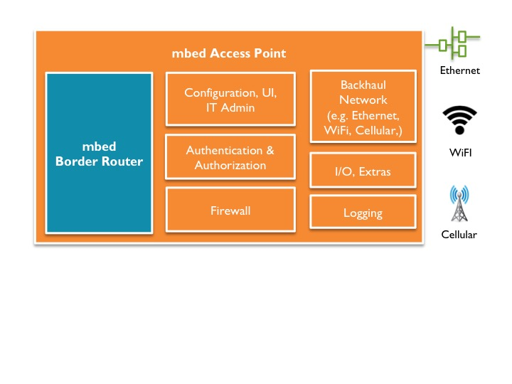

<!--- Copyright (c) 2016 ARM Limited. All rights reserved.) --->

# mbed Access Point for Thread networks

mbed Access Point for Thread is a wireless access point that manages Thread networks and provides the necessary features to integrate a Thread network into an IT environment and cope with existing backhaul networks. It is a combination of the mbed 6LoWPAN Border Router (Thread Border Router) and the Linux Router.    

This document provides instructions for building an mbed Access Point for Thread based on Raspberry Pi 2B and the mbed 6LoWPAN Border Router.

You can:

* [Use a pre-built image based on OpenWrt for Raspberry Pi 2B](#using-the-pre-built-image).
* [Generate an image from a source with custom configuration](#generating-an-image-from-source).

## The architecture

The architecture described in this document consists of two embedded boards, an mbed 6LoWPAN Border Router and a Linux Router. The motivation behind this two-board design is to achieve a mesh-agnostic mbed Access Point: we can use either a [Thread](https://www.threadgroup.org/) or a 6LoWPAN Border Router.

The Thread Border Router is an IPv6 router that routes between regular and Thread network segments. Thread is designed for highly constrained IP networking, where bandwidth or energy is in short supply. Consequently, the Thread Border Router has some additional functionality to translate between the two domains.

The Linux Router is a resource-rich device capable of running Linux or a Linux-like operating system. It provides features typically expected by IT administrators, like VLAN support, authentication and authorization services, network management and logging, tunneling support, firewall and wireless mesh network management.

## Hardware components
The figure below provides an overview of the mbed Access Point hardware components:

<span class="images"></span>

You will need:

1. Raspberry Pi 2B (working as the Linux Router).
1. [mbed 6LoWPAN Border Router HAT](https://developer.mbed.org/platforms/mbed-6LoWPAN-Border-Router-HAT/).
1. Micro-USB cable.
1. Micro-SD card.
1. Micro-SD to SD card adapter.
1. Ethernet cable.

<span class="images"></span>

## Software components

The software components of mbed Access Point are outlined in the picture below.



We've all the hardware components needed. Let's start building our mbed Access Point. Remember that you have two options: using a pre-built image, and generating a new image from source.

### Installing the mbed Access Point image on the Raspberry Pi

#### Using the pre-built image

The pre-built image for Raspberry Pi 2B contains the necessary modules and packages to convert a Raspberry Pi into an OpenWrt-based Linux Router.

The current version of mbed Access Point doesn't support tunneling, so it needs IPv6 support in the backbone network to set up end-to-end communication (Thread end nodes to [mbed Device Connector](https://connector.mbed.com/)). If your backbone network only supports IPv4, you can use the default LAN network prefix included in the image: it creates an isolated Thread network based on the [ULA](https://tools.ietf.org/html/rfc4193) prefix `fd00:db80::/64`, so you can set up a Thread network without IPv6 support. The limitation in this configuration is that the Thread end nodes can only talk with mbed Access Point.

To use the pre-built image:

1. Download the mbed Access Point [image!](binaries/openwrt-mbedap-v2.0.0-brcm2708-bcm2709-rpi-2-ext4-sdcard.img).
1. Install the image on a Mirco-SD card. This [link](https://www.raspberrypi.org/documentation/installation/installing-images/) provides step by step instructions.
1. Insert the Mirco-SD card into the Raspberry Pi's Mirco-SD card slot.

#### Generating an image from source

This repository contains the build system for an mbed Access Point based on the OpenWrt build system. This allows you to build the image from source:

1. Install the build system [prerequisites](https://wiki.openwrt.org/doc/howto/buildroot.exigence).
1. Clone the repository onto a local machine.
1. Run `./scripts/feeds update -a` to get all the latest package definitions defined in `feeds.conf.default`.
1. Run `./scripts/feeds install -a` to install symlinks of all of them into `package/feeds/`.
1. Run `make menuconfig` to change the configuration for your image.
1. Run make to build the mbed Access Point image.

    ```
    make
    ```
Use V=s for verbose build log:

    ```
    make V=s
    ```
1. The generated image (.img file) is located in the directory ``./bin/brcm2708/``.
1. Install the image on a Mirco-SD card. This [link](https://www.raspberrypi.org/documentation/installation/installing-images/mac.md) provides step by step instructions.
1. Insert the Mirco-SD card into the Raspberry Pi's Mirco-SD card slot.

## Prepare the mbed 6LoWPAN Border Router

### The DAPLink interface
[The mbed 6LoWPAN Border Router HAT](https://developer.mbed.org/platforms/mbed-6LoWPAN-Border-Router-HAT/) contains a DAPLINK interface that connects to the host computer over USB and provides the following interfaces:

1. A driver-less HID interface that provides a channel over which the CMSIS-DAP debug protocol runs. This enables all the industry-standard toolchains to program and debug the target system.
1. USB Disk drag and drop programming: DAPLink debug probes appear on the host computer as a USB disk. Program files in binary (.bin) and hex (.hex) formats can be copied onto the USB disk using drag and drop, which then programs them on the target system.
1. USB Serial Port: The DAPLink debug probe also provides a USB serial port that can be bridged through to a TTL UART on the target system. The USB Serial port will appear on a Windows machine as a COM port, or on a Linux machine as a /dev/tty interface.

**Tip:** More information can be found at [DAPLINK](https://docs.mbed.com/docs/mbed-os-handbook/en/latest/advanced/DAP/).

### Installing the binary

___Getting the binary___

The Thread Border Router firmware is only avaialbe in binary form to mbed users. But, ARM mbed Partners can download the source from [here](https://github.com/ARMmbed/thread-testapp-private).
The Thread Border Router binary with the default configuration (RF channel = 26 and PAN ID = 0xface) is available [here!](binaries/thread-testapp-private_gff74fb0.bin).

___Installing___

1. Connect the mbed 6LoWPAN Border Router to a laptop using the Micro-USB cable.
1. Ensure that the blue jumper (RESET-EN) is in the **off** position.
1. Program your binary on the mbed 6LoWPAN Border Router using drag and drop. Wait until the red LED stops blinking to ensure that programming is complete.
1. Attach the mbed 6LoWPAN Border Router to the Raspberry Pi, so that it fits firmly on top of the GPIO headers.
1. Don't forget to move the blue jumper (RESET-EN) to **on** position.

**Note**: mbed 6LoWPAN Border Router will be held in reset either until LAN interface on RPi is up and has a global IPv6 addresses, or for a maximum of 20 seconds.

## Communicating with the mbed Access Point through SSH or web GUI

It is possible to communicate with mbed Access Point using either SSH or web GUI. For testing, we'll use SSH to enter and execute the commands.

**Tip:** You can also use the web GUI to configure and check the health of your mbed Access Point.

___Identifying the IP address___

To communicate with mbed Access Point, you need to identify its IP address. You can choose either of the following methods:

Method 1:

1. Power on the Raspberry Pi.
1. Wait until the red LED on the Raspberry Pi stops blinking.
1. Power off the Raspberry Pi and remove the Mirco-SD card.
1. Insert the Micro-SD card into the laptop using a *Micro-SD to SD card* adapter. The SD card will be mounted automatically.
1. The IP address of the mbed Access Point is in the file "ip_address.txt".

Method 2:

1. Connect the Raspberry Pi to the network over Ethernet.
1. Power on the Raspberry Pi.
1. Monitor LLDP traffic on your network using Wireshark. The mbed Access Point sends LLDP advertisements, which contain the IP address.

___Using SSH___

You can use secure shell (`ssh`) to remotely access mbed Access Point on the IP address you identified in the previous step:

    ```
    ssh root@<mbed ap ip address>
    ```

**Note:** SSH access is enabled on the WAN interface. We recommend you set a strong password for the root account, or [use the SSH Public Key authentication](https://wiki.openwrt.org/oldwiki/dropbearpublickeyauthenticationhowto).

___Using the web___

mbed Access Point runs a LuCI instance, which can be accessed using the URL `https://<mbed ap ip address>`.

Use root user credentials to log in.

## Testing and verifying network connectivity

If you have followed all the instructions, then you should have an mbed Access Point instance capable of managing a Thread network. The next step is to perform basic tests that verify network connectivity between the Linux Router and the mbed 6LoWPAN Border Router.

### Backbone network with IPv4 support only

As described before, if your backbone network only supports IPv4, then ULA addresses are used to set up the Thread network. In this case, the scope of Thread traffic is limited to mbed Access Point, as the ULA addresses are not routable over the Internet. However, all  devices in the Thread network (mbed Access Point, the mbed 6LoWPAN Border Router and end nodes) can talk to each other.

Let us try to ping the Thread Border Router from the Linux Router:

1. Power up the Raspberry Pi and wait until both the Raspberry Pi and the Thread Border Router are up.
1. Log into Raspberry Pi (Linux Router) using SSH:

    ```
    ssh root@<mbed access point ip address>
    ```
1. Run the `ifconfig` command and ensure that link-local and unique local address are set up on the LAN (sl0) interface:

    ```
    sl0       Link encap:UNSPEC  HWaddr 00-00-00-00-00-00-00-00-00-00-00-00-00-00-00-00  
          inet addr:10.99.99.1  P-t-P:10.99.99.1  Mask:255.255.255.0
          inet6 addr: fe80::669f:f10:87d:3050/64 Scope:Link
          inet6 addr: fd00:db80::1/64 Scope:Global
          UP POINTOPOINT RUNNING NOARP MULTICAST  MTU:1500  Metric:1
          RX packets:7 errors:0 dropped:0 overruns:0 frame:0
          TX packets:13 errors:0 dropped:0 overruns:0 carrier:0
          collisions:0 txqueuelen:10
          RX bytes:464 (464.0 B)  TX bytes:1680 (1.6 KiB)
    ```
1. Run `ip -6 route show` and ensure that the routing table has an entry to route packets through the LAN (sl0) interface:

    ```
    fd00:db80::/64 dev sl0  proto static  metric 1024  pref medium
    fe80::/64 dev sl0  proto kernel  metric 256  pref medium
    ```
1. Connect the Thread Border Router to your laptop using a mirco-USB cable.
1. To monitor logs form the Thread border router, you can use terminal utilities like Minicom or PuTTY. Make sure the terminal utility is set to 115200 baud rate and 8N1.
1. The Thread Border Router will use the router advertisements sent by the Linux Router to generate IPv6 addresses for both the backhaul and radio interfaces. Wait until the bootstrap is complete.

    ```
       _   ___ __  __               _            _  ___  ___
      /_\ | _ \  \/  |  ___   _ __ | |__  ___ __| |/ _ \/ __|
     / _ \|   / |\/| | |___| | '  \| '_ \/ -_) _` | (_) \__
    /_/ \_\_|_\_|  |_|       |_|_|_|_.__/\___\__,_|\___/|___/

    /> I'm Thread (Border) Router
    [DBG ][cApp]: cmd tasklet init
    [DBG ][cApp]: network_event_handler-ARM_LIB_TASKLET_INIT_EVENT
    [DBG ][cApp]: cmdline_event-ARM_LIB_TASKLET_INIT_EVENT
    mesh0 bootstrap ongoing..
    eth0 ready
    Ethernet (eth0) bootstrap ready. IP: fd00:db80::6407:8f79:ef5d:2052
    Bootstrap ready
    />
    ```

1. The Thread Border Router offers command-line like interface to enter the commands. Type in `ifconfig` in the terminal utility. You should see the following output:

    ```
    />ifconfig
    Interface tun0:

      State:               None

    interface eth0:

      State:               CONNECTED
      Metric:              0
      MAC-48:              4a:47:97:f5:e0:82
                                          IPv6 if addr:
       role[0]: fe80::4847:97ff:fef5:e082
       role[1]: fd00:db80::6407:8f79:ef5d:2052

    Interface mesh0:
      State:               CONNECTED
      Metric:              1000
      Mode:                Router
      Extension:           6LoWPAN Thread with MLE Attached
      Bootstrap retries:   0
      MAC:                 fc:c2:3d:00:00:03:11:ee
      br-ula-prefix:       fd:00:0d:b8:00:00:00:00
      radio type:          2.4GHz
      channel page:        0
      |-channel(s):        16,
      Thread device configuration
          Company:ARM ltd Model:MbedOS Ver:(1.1)
      |-EUI64:               fc:c2:3d:00:00:03:11:ee
      |-PSKd:                threadjpaketest
      |-provisioning-url:    Not set
      |-max Child count:     32
      |-Downgrade Threshold: 23
      |-Upgrade Threshold:   16
      |-Reed advertisement interval:   570, 60
      Static thread network config
      |-networkid:         Arm Powered Core..
      |-PSKc:              74:68:72:65:61:64:6a:70:61:6b:65:74:65:73:74:00
      |-ML-ULA-prefix:     fd:00:0d:b8:00:00:00:00
      |-ML-EID:            fc:c7:66:d8:d8:52:4d:20
      |-private_mac:       87:c8:bc:36:d6:f9:0d:7a
      |-panId:             face
      |-extended-pan-id:   00:0d:b8:00:00:90:b9:72
      |-Key:               00:11:22:33:44:55:66:77:88:99:aa:bb:cc:dd:ee:ff
        |-rotation:        3600
        |-seq-counter:     0
      |-Security Policy:   255
      |-Channel:           16
      |-link-timeout:      240 s.
      |-timestamp:         0
      MAC 16-bit:          00:00
      MAC 64-bit:          87:c8:bc:36:d6:f9:0d:7a
      IID:                 85:c8:bc:36:d6:f9:0d:7a
      Radio if address
       [0]: fe80::85c8:bc36:d6f9:d7a
       [1]: fd00:db8::fcc7:66d8:d852:4d20
       [2]: fd00:db8::ff:fe00:fc00
       [3]: fd00:db8::ff:fe00:0
       [4]: fd00:db8::ff:fe00:fc01
       [5]: fd00:db80::85c8:bc36:d6f9:d7a
    ```

1. The line `role[1]: fd00:db80::6407:8f79:ef5d:2052` indicates the IPv6 address of the backhaul interface.
1. The line `[5]: fd00:db80::85c8:bc36:d6f9:d7a` indicates the IPv6 address of radio interface.
1. Switch to a terminal with the SSH connection to the Linux Router. Try pinging the mbed 6LoWPAN Border Router using the ULA address:
```
ping6 fd00:db80::6407:8f79:ef5d:2052    // Pinging backhaul interface
ping6 fd00:db80::85c8:bc36:d6f9:d7a     // Pinging radio interface
```

### Backbone network with IPv6 and DHCP-PD support
The mbed Access Point includes odhcp6c module, which is a minimal DHCPv6 and RA-client. odhcp6c supports RA + stateful DHCPv6 (either IA_NA or IA_PD or both). If your backbone supports IPv6 and DHCP-PD, then the odhcp6c will request the global prefix from the backbone router and configure the Thread network according to the prefix received.

### Creating a Thread Network
Congratulations!! You have just created an mbed Access Point for Thread. It's time to explore the world of Thread networks. Follow the instructions described in [mbed-os-example-client](https://github.com/ARMmbed/mbed-os-example-client) to set up Thread end nodes.

**Tip:** Please ignore the instructions regarding the border router, as it is part of the mbed Access Point.

The end nodes will send LWM2M registration messages to mbed Device Connector.

**Note:** If your backbone network doesn't support IPv6 then these messages will not be sent out of the mbed Access Point; you should still be able to ping all the end nodes from the mbed Access Point.

If you have any questions or would like to start a discussion then please create an issue in the [mbed Access Point GitHub repository](https://github.com/ARMmbed/mbed-access-point-private).

This work is partially supported by the [Horizon 2020 programme](http://ec.europa.eu/programmes/horizon2020/) of the European Union, under grant agreement number 644332.
